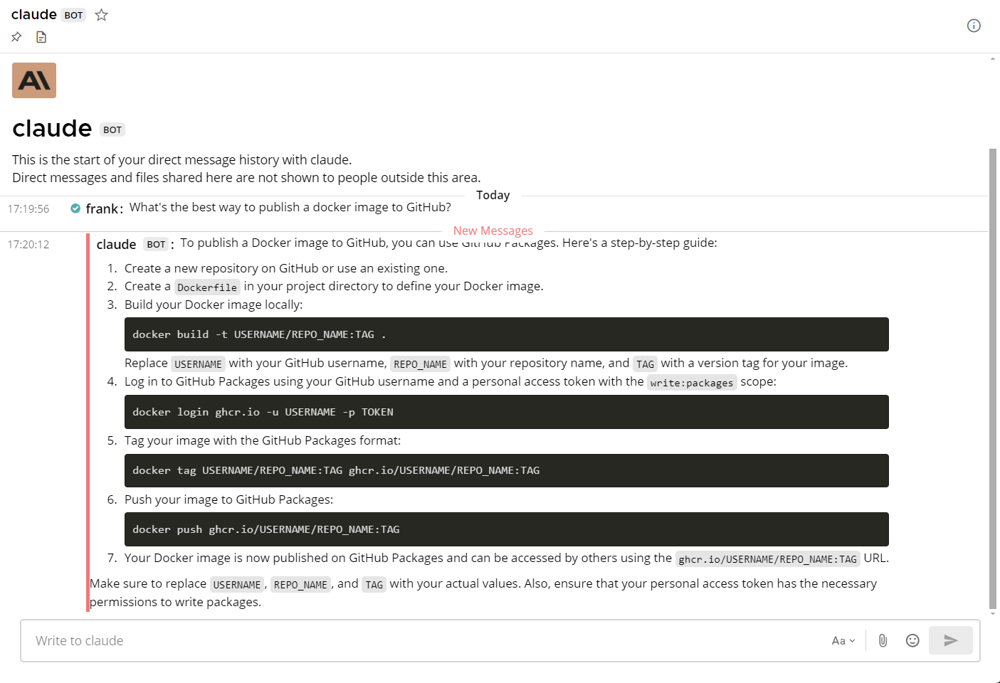

[](https://github.com/Elehiggle/Claude3MattermostChatbot/stargazers)
[](https://github.com/Elehiggle/Claude3MattermostChatbot/actions/workflows/docker-publish.yml)
[](https://hub.docker.com/r/elehiggle/claude3mattermostchatbot)
[](https://hub.docker.com/r/elehiggle/claude3mattermostchatbot)
[](https://github.com/Elehiggle/Claude3MattermostChatbot/commits/master)
[](https://app.codacy.com/gh/Elehiggle/Claude3MattermostChatbot/dashboard?utm_source=gh&utm_medium=referral&utm_content=&utm_campaign=Badge_grade)
[](https://github.com/Elehiggle/Claude3MattermostChatbot/blob/master/LICENSE)

# Claude3MattermostChatbot



This project is a chatbot for Mattermost that integrates with the Anthropic API to provide helpful responses to user messages. The chatbot - like this readme - is mostly written by **Claude 3 AI**, listens for messages mentioning the chatbot or direct messages, processes the messages, and sends the responses back to the Mattermost channel.

## Features

- **Responds to messages** mentioning "@chatbot" (or rather the chatbot's username) or direct messages
- **Extracts text content from links** shared in the messages. Also supports **FlareSolverr** to bypass
  Javascript/CAPTCHA restrictions
- Supports the **Vision API** for describing images provided as URLs within the chat message
- **Gets transcripts of YouTube videos** for easy tl;dw summarizations
- Maintains context of the conversation within a thread
- Sends typing indicators to show that the chatbot is processing the message
- Utilizes a thread pool to handle multiple requests concurrently (due to `mattermostdriver-asyncio` being outdated)
- Offers **Docker support** for easy deployment

## Prerequisites

- Python 3.11 or just a server with [Docker](https://docs.docker.com/get-started/). _(you can get away with using 3.8 if
  you use datetime.datetime.utcnow() instead of datetime.datetime.now(datetime.UTC))_
- Anthropic API key
- Mattermost server with API access
- Mattermost Bot token (alternatively personal access token or login/password for a dedicated Mattermost user account for the chatbot)
- The bot account needs to be added to the team and to the channels you want it to watch

## Installation

1. Clone the repository:

    ```bash
    git clone https://github.com/Elehiggle/Claude3MattermostChatbot.git
    cd Claude3MattermostChatbot
    ```

2. Install the required dependencies:

    ```bash
    pip3 install -r requirements.txt
    ```
   _or alternatively:_
    ```bash
    python3.12 -m pip install anthropic mattermostdriver certifi beautifulsoup4 pillow httpx youtube-transcript-api
    ```

3. Set the following environment variables with your own values (most are optional):

| Parameter              | Description                                                                                                                                                                                               |
|------------------------|-----------------------------------------------------------------------------------------------------------------------------------------------------------------------------------------------------------|
| `AI_API_KEY`           | Required. Your Anthropic API key                                                                                                                                                                          |
| `AI_MODEL`             | The Anthropic model to use. Default: "claude-3-opus-20240229"                                                                                                                                             |
| `MATTERMOST_URL`       | Required. The URL of your Mattermost server                                                                                                                                                               |
| `MATTERMOST_TOKEN`     | Required if not using user/password. The bot token (alternatively personal access token) with relevant permissions created specifically for the chatbot. Don't forget to add the bot account to the team. |
| `MATTERMOST_USERNAME`  | Required if not using token. The username of the dedicated Mattermost user account for the chatbot (if using username/password login)                                                                     |
| `MATTERMOST_PASSWORD`  | Required if not using token. The password of the dedicated Mattermost user account for the chatbot (if using username/password login)                                                                     |
| `MATTERMOST_MFA_TOKEN` | The MFA token of the dedicated Mattermost user account for the chatbot (if using MFA)                                                                                                                     |

### Extended optional configuration variables:

| Parameter                     | Description                                                                                                                                                                                                                                                                                    |
|-------------------------------|------------------------------------------------------------------------------------------------------------------------------------------------------------------------------------------------------------------------------------------------------------------------------------------------|
| `AI_SYSTEM_PROMPT`            | The system prompt/instructions. Default: [click](https://github.com/Elehiggle/Claude3MattermostChatbot/blob/d82b0dfc0065aa6c88ad2b2c4e6990252f20e247/chatbot.py#L47) (Subject to change. current_time and chatbot_username variables inside the prompt will be auto-formatted and substituted. |
| `AI_TIMEOUT`                  | The timeout for the AI API call in seconds. Default: "120"                                                                                                                                                                                                                                     |
| `MAX_TOKENS`                  | The maximum number of tokens to generate in the response. Default: "4096" (max)                                                                                                                                                                                                                |
| `TEMPERATURE`                 | The temperature value for controlling the randomness of the generated responses (0.0 = analytical, 1.0 = fully random). Default: "0.15"                                                                                                                                                        |
| `MAX_RESPONSE_SIZE_MB`        | The maximum size of the website content to extract (in megabytes). Default: "100"                                                                                                                                                                                                              |
| `FLARESOLVERR_ENDPOINT`       | Endpoint URL to your [FlareSolverr](https://github.com/FlareSolverr/FlareSolverr) instance (eg. http://192.168.1.55:8191/v1). If you use this, MAX_RESPONSE_SIZE_MB won't be honored since it can't stream content                                                                             |
| `MATTERMOST_IGNORE_SENDER_ID` | The user ID of a user to ignore (optional, useful if you have multiple chatbots to prevent endless loops)                                                                                                                                                                                      |
| `MATTERMOST_PORT`             | The port of your Mattermost server. Default: "443"                                                                                                                                                                                                                                             |
| `MATTERMOST_SCHEME`           | The scheme of the connection. Default: "https"                                                                                                                                                                                                                                                 |
| `MATTERMOST_BASEPATH`         | The basepath of your Mattermost server. Default: "/api/v4"                                                                                                                                                                                                                                     |
| `MATTERMOST_CERT_VERIFY`      | Cert verification. Default: True (also: string path to your certificate file)                                                                                                                                                                                                                  |
| `AI_API_BASEURL`              | AI API Base URL. Default: None (which will use "https://api.anthropic.com"). Useful if you want to use a different AI with Anthropic compatible endpoint                                                                                                                                       |

## Usage

Run the script:

```bash
python3.12 chatbot.py
```

The chatbot will connect to the Mattermost server and start listening for messages.
When a user mentions the chatbot in a message or sends a direct message to the chatbot, the chatbot will process the message, extract text content from links (if any), handle image content using the Vision API, and send the response back to the Mattermost channel.

> **Note:** If you don't trust your users at all, it's recommended to disable the URL/image grabbing feature, even though the chatbot filters out local addresses and IPs.

### Running with Docker

You can also run the chatbot using Docker. Use the following command to run the chatbot container:

```bash
docker run -d --name chatbotclaude \
  -e AI_API_KEY="your_ai_api_key" \
  -e AI_MODEL="claude-3-opus-20240229" \
  -e MATTERMOST_URL="mattermostinstance.example.com" \
  -e MATTERMOST_TOKEN="your_mattermost_token" \
  -e MAX_TOKENS="4096" \
  -e TEMPERATURE="0.15" \
  ghcr.io/elehiggle/claude3mattermostchatbot:latest
```

## Known Issues

- Typing indicator is only sent to the channel, not the conversation thread. There is some issue I haven't figured out yet. I even prefer it this way, but mobile users can't see the channel while in a thread.

Other than that, while the chatbot works great for me, there might still be some bugs lurking inside. I have done my best to address them, but if you encounter any issues, please let me know!

## Monkey Patch

Please note that the monkey patch in the code is necessary due to some SSL errors that occur because of a mistake within the `mattermostdriver` library. The patch ensures that the chatbot can establish a secure connection with the Mattermost server.

## Related Projects

[OpenAI ChatGPT Mattermost Chatbot](https://github.com/Elehiggle/ChatGPTMattermostChatbot)

## Contributing

Contributions are welcome! If you find any issues or have suggestions for improvements, please open an issue or submit a pull request.

## License

This project is licensed under the MIT License.

## Acknowledgements

- [Anthropic](https://www.anthropic.com/) for providing the API for generating responses
- [Mattermost](https://mattermost.com/) for the messaging platform
- [mattermostdriver](https://github.com/Vaelor/python-mattermost-driver) for the Mattermost API client library
- [chatgpt-mattermost-bot](https://github.com/yGuy/chatgpt-mattermost-bot) for inspiring me to write this python code
- [youtube-transcript-api](https://pypi.org/project/youtube-transcript-api/) for the YouTube Transcript Fetch library